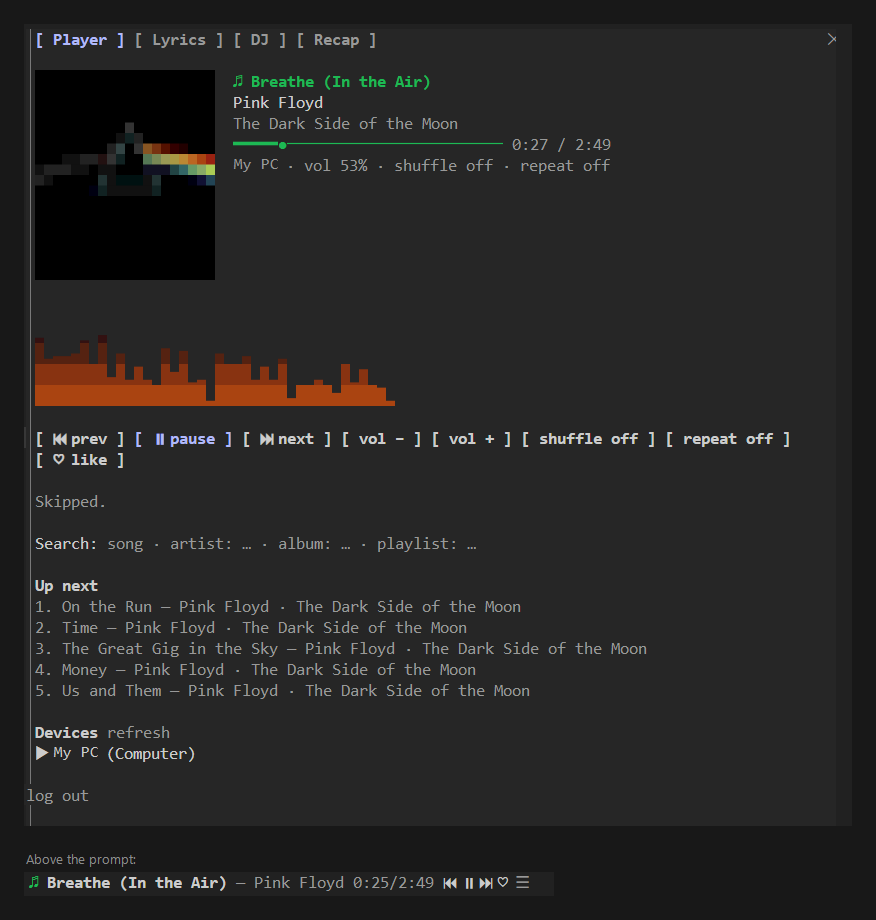

# Spotify for Claude Code

A [Claude Code mod](https://code.claude.com/docs/en/plugins/mods/overview) that puts Spotify inside your coding session: a player pane with album art and a visualizer, time-synced lyrics, a Claude DJ that learns your taste, a chime when Claude finishes or needs you, a focus timer, your library, and a recap of the session's soundtrack. Every option is on one settings page. Apart from the DJ and the buttons you press, it never changes what's playing.



## Features

- **Now playing everywhere**: the track in the status line, a band above the prompt with ⏮ ⏯ ⏭ ♥ and the lyric being sung, and a toast when the track changes.
- **Player pane** (`/spotify`), in six tabs:
  1. **Player**: album art (small, medium or large), an animated spectrum in the cover's colors, playback controls with hotkeys, search, up next, and device switching. In the desktop app the art and the visualizer are drawn as SVG.
  2. **Lyrics**: synced lyrics from [LRCLIB](https://lrclib.net) with the current line highlighted. Press a line to jump to it. Nudge the timing earlier or later when a track's lyrics are off; it's remembered per track.
  3. **DJ**: Claude reads the session, picks a vibe and a set of tracks, says why, and plays or queues them. It learns from DJ picks you skip or like. **Autopilot** re-picks every few turns, and reacts when tests fail (calmer) or go green (upbeat).
  4. **Recap**: every track played this session next to what Claude was doing meanwhile (files edited, tool calls, tests going red or green), with stats: minutes listened, top artist, your most productive track. Play any row, play it all, save it as a playlist, or copy a summary card.
  5. **Library**: your playlists, Liked Songs and recently played, one press to play.
  6. **Settings**: every option below, grouped, with a picker for each.
- **Chimes**: a short sound when a long turn ends, and (if you turn it on) when Claude is waiting on a permission prompt or a question. The music is never touched.
- **Focus timer**: `/spotify focus 25` shows a countdown above the prompt, then a break timer. It doesn't start, pause or queue anything.
- **Tools Claude can call**: `now_playing`, `control`, `play`, `search`, `queue`, `devices`. Try asking "play something calm while we debug this". Opt in, and Claude is also told what's playing when the track changed.

## Requirements

- Claude Code v2.1.287 or later (mods)
- A Spotify account. Free works; Premium adds playback control ([what each gets](#free-and-premium-accounts))
- A Spotify app of your own (free; steps below)
- Windows for album art, the chime's system sounds and encrypted login (all through PowerShell). Everything else works on macOS and Linux too. On macOS the chime plays a bundled sound; automatic login needs `python3`, otherwise paste the redirect URL.

## Free and Premium accounts

Spotify only lets Premium accounts control playback through its API. The mod reads your plan when you log in and adapts:

| | Free | Premium |
| --- | --- | --- |
| Now playing, album art, visualizer, synced lyrics | ✓ | ✓ |
| Search, library, like/unlike, device list, session recap | ✓ | ✓ |
| Save the recap as a playlist | ✓ | ✓ |
| Play, pause, skip, volume, seek, shuffle, repeat, queue, switch device | Opens tracks in Spotify instead | ✓ |
| Claude DJ | Saves the set as a playlist and opens it | Plays or queues the set |
| DJ autopilot | — | ✓ |

On a free account the playback buttons are hidden, ▶ becomes ↗ (open in Spotify), and Claude's playback tools explain the limit instead of failing.

> **Note for app owners:** Spotify's development mode has its own limits. The app must be owned by a Premium account, and only users added under **User Management** can sign in. If you're on a free account, ask a Premium friend to create the app and add you, or apply for extended quota.

## Install

Add this repository as a marketplace and install the plugin:

```
/plugin marketplace add jewdev/claude-spotify-mod
/plugin install spotify@claude-spotify-mod
```

Or load it from a clone for one session:

```
git clone https://github.com/jewdev/claude-spotify-mod
claude --plugin-dir ./claude-spotify-mod/spotify
```

## Set up Spotify

1. Go to the [Spotify developer dashboard](https://developer.spotify.com/dashboard) and create an app.
2. Tick **Web API**, and add the redirect URI `http://127.0.0.1:8888/callback`.
3. Copy the app's **Client ID**. No client secret is needed: login uses PKCE.
4. In Claude Code:

   ```
   /spotify setup <client-id>
   /spotify login
   ```

   Your browser opens and asks you to approve. A small local listener on `127.0.0.1:8888` catches the redirect, and you're connected. If the browser shows a connection error instead, copy its address and run `/spotify code <url>`.

You can also set the client ID in `/config` under the plugin's options.

## Settings

Open the **Settings** tab (`/spotify settings`, or `6` in the pane), or use `/spotify set <key> <value>`. `/spotify set` lists everything; `/spotify set reset` restores the defaults.

| Group | Key | Options (default first) | What it does |
| --- | --- | --- | --- |
| General | `band` | on, off | The now-playing row above the prompt |
| | `bandLyrics` | on, off | The line being sung, under the band |
| | `trackToasts` | on, off | A toast when the track changes |
| | `noticeFade` | 6, 3, 10, never | Seconds before pane messages fade |
| | `polling` | smart, fast, saver | Smart: every 3 s while playing, every second near a track's end, every 10 s when paused |
| Player | `art` | medium, small, large, off | Cover size: 16, 12 or 24 pixels a side |
| | `visualizer` | on, off | The animated bars |
| | `lyrics` | on, off | Fetch lyrics from LRCLIB |
| DJ | `autopilot` | off, on | Re-pick every few turns (Premium) |
| | `djEvents` | on, off | React to tests failing and passing |
| | `djLearns` | on, off | Remember DJ picks you skip (under 30 s) or like |
| | `djCount` | 6, 4, 10 | Tracks per set |
| Cues | `doneCue` | chime, off | A chime when a long turn ends |
| | `doneAfter` | 60, 30, 120, 300 | Seconds a turn must take to cue |
| | `waitingCue` | off, chime | A chime when a permission prompt or a question waits for you |
| Focus | `focusLength` | 25, 15, 50, 90 | Minutes per focus block |
| | `breakLength` | 5, 0, 10, 15 | Minutes of break timer after it |
| Claude | `shareNowPlaying` | off, on | A short note with your next prompt when the track changed |
| Privacy | `protectTokens` | on, off | Encrypt the saved login with Windows DPAPI |

## Commands

| Command | What it does |
| --- | --- |
| `/spotify` | Open the player pane |
| `/spotify play [query]` | Resume, or play the best match (`track:`, `album:`, `artist:`, `playlist:` prefixes) |
| `/spotify pause` · `toggle` · `next` · `prev` | Playback |
| `/spotify vol <0-100\|+N\|-N>` · `seek <s\|m:ss>` | Volume and position |
| `/spotify shuffle` · `repeat` · `like` | Toggles |
| `/spotify queue <query>` · `search <query>` | Queue the best match, or search in the pane |
| `/spotify devices` · `device <name>` | List devices, or move playback |
| `/spotify lyrics [earlier\|later\|reset]` | Synced lyrics, or nudge their timing |
| `/spotify dj [hint]` | Claude DJs for the session, e.g. `/spotify dj calm, I'm debugging` |
| `/spotify autopilot [on\|off]` | Let the DJ follow the session's mood |
| `/spotify focus [minutes\|stop\|status]` | A focus countdown, then a break |
| `/spotify library` | Playlists, Liked Songs, recently played |
| `/spotify recap [save [name]]` | The session soundtrack with stats, or save it as a playlist |
| `/spotify recap play [n]` | Play the whole soundtrack, or its track n |
| `/spotify settings` · `set <key> <value>` | Every option |
| `/spotify band` | Show or hide the band above the prompt |
| `/spotify login` · `logout` · `setup <id>` | Account |

Pane hotkeys: `1`–`6` switch tabs. Player: `p` play/pause, `n` next, `b` back, `u`/`d` volume, `s` shuffle, `r` repeat, `l` like. Lyrics: `z` earlier, `x` later, `c` reset. DJ: `j` spin a set, `a` autopilot. Recap: `p` play all, `v` save as playlist, `y` copy summary. Library: `q` playlists, `w` Liked Songs, `e` recently played.

## Privacy and security

- Your client ID and login are stored by Claude Code in the plugin's store under your Claude configuration directory, never in this repository. On Windows the refresh token is encrypted with DPAPI for your user account (passed to PowerShell on stdin, never on a command line), and the short-lived access token is kept in memory only. `/spotify logout` deletes it all.
- The mod talks to `api.spotify.com`, `accounts.spotify.com`, and `lrclib.net` (lyrics: track name, artist, album and duration only), and downloads cover images from Spotify's CDN.
- The DJ sends a summary of your session to Claude through Claude Code's own model calls: a fork of the current conversation, or a short activity summary for autopilot. It uses your plan's usage. Its taste memory (tracks you skipped or liked) stays in the plugin's store.
- With `shareNowPlaying` on, the track's name and artist are added to the conversation before your next prompt.
- Like every mod, this code runs with your permissions. Read it before installing; `claude plugin validate spotify` lists everything it hooks and calls.

## Limitations

- The visualizer is decorative. Spotify no longer offers audio analysis to new apps, so the bars move on a steady beat seeded by the track, not the real audio.
- Album art and the encrypted login need Windows. On other systems the login is stored without encryption.
- Apps in Spotify's development mode only work for accounts added under **User Management** in the dashboard.
- Saving playlists needs playlist permissions. If you logged in with an older version, run `/spotify login` again.

## Development

```
claude plugin validate spotify   # what the mod hooks and calls
claude plugin test spotify       # the test suite, against the engine with Spotify faked
```

The hooks module is `spotify/hooks/register.tsx`. Pure helpers live in `lib.ts` (API shapes, auth), `media.ts` (lyrics, drawings, the DJ, the recap, host scripts) and `settings.ts` (the settings schema and the rules it drives). The `$.state` contract is `spotify/types/index.d.ts`. CI runs both commands on every push.

## License

MIT
